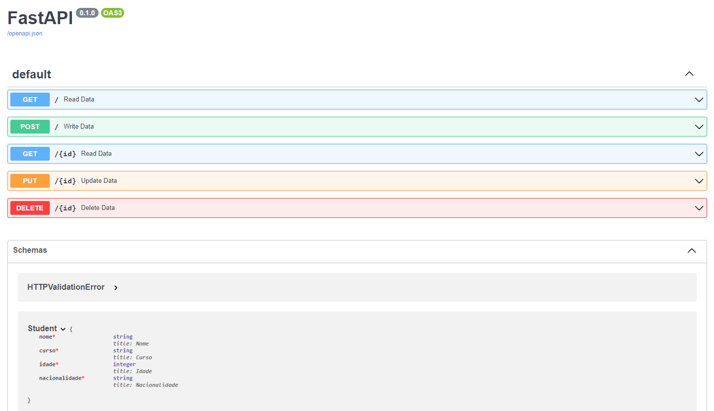

# FastAPI-CRUD

Um repositório destinado a criação de uma API utilizando o Framework FastAPI do Python. A intenção é criar uma API com os métodos de CRUD em um banco de dados de estudantes

## Feito com:

 <p align="left">
 <a href="https://www.python.org" target="_blank" rel="noreferrer">  </a>
 <a href="https://fastapi.tiangolo.com/" target="_blank" rel="noreferrer">  </a>
</p>

## Requisitos:

* Python
* FastAPI
* MySQL

## Pré-visualização


# Instruções de instalação:

```sh
1 - Realize o download dos arquivos. Você pode fazer isso da seguinte forma:
    1.1 - Baixar esse repositório em formato .zip e por fim extrair os arquivos para uma pasta de sua preferência.
    1.2 - Clonar esse repositório através do git com o seguinte comando: "$ git clone https://github.com/MauPxt/FastAPI-CRUD".
2 - No terminal utilizar o comando "$ pip install -r requirements.txt"
3 - Criar um schema no MySQL com nome "students"
4 - Criar um table com nome "students" e por características que podem ser encontradas no arquivo "/models/student.py" (No MySQL, troque String por Varchar)
5 - No terminal digite o comando "$ uvicorn main:app --reload" para iniciar a API
6 - Acesse o url "localhost:8000" para fazer requisições na API
  6.1 - Acesse o url "localhost:8000/docs" para acessar a documentação da API
```
